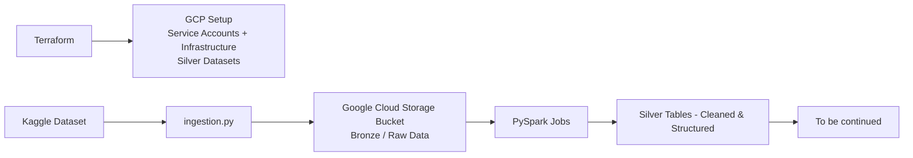

# Overview

End-to-end data engineering project on Google Cloud Platform implementing a scalable ELT pipeline. The system uses Airflow for orchestration, Terraform for infrastructure provisioning, PySpark for data processing, and dbt for analytics modeling. Data is ingested from Kaggle datasets into a cloud-based data lake architecture.


# Mermaid diagram
for now more or less it looks like this:



# Current problems and approaches

### Pyspark / dbt <br>

Why Pyspark in such simple transformations in silver layer ? - I really wanted try out pyspark with dbt so i decided on a whim using Pyspark here even tho it's pretty much unnecessary <br>
At first idea was to use External Tables in gcp bigquery for bronze layer but I really struggled to debug some problems with storage api , Pyspark kept on throwing errors probably wouldnt be a case if I used SQL instead. <br>
Tried different approach to use buckets for keeping raw data=bronze layer so now I read data directly from the bucket and removed bronze_dataset as it's unnecessary now<br>
Another problem with Pyspark in gcp - for whatever reason whenever I submit a batch query for Pyspark it doesn't send my ```bash dbt_project.yml``` along so I cannot use variables declared inside and have to hardcode them inside each .py file <br>
Problems with service accounts I actually don't know why it happend but despite having declared Service account for spark it kept on using default one - kinda resolved with terraform as I don't create seperate new iam member but just add permissions directly from terraform.tf file to default service account so no need to give permissions 'on fly' with CLI<br>

---

I initialy wanted to query bronze tables using Pyspark but obviously something went wrong I had some problems with mismatched versions and Java when I tried running Pyspark locally so I decided upon going back to external tables idea so bronze tables can be queried easily via BigQuery on GCP so had to re-write src_olist.yml so it works with ```bash dbt run-operation stage_external_sources```. Dataset is a bit more messy than expected , had to map wrong city names to correct one , I used google sheets for that with regexp and lookups comparing to dataset of brazil city names then dropped it to ```bash seeds/``` and gcs for easy reading 

### Docker/airflow
My initial docker compose was kinda faulty Dags were not being parsed at all , Airflow UI displayed hostname not available aswell as refused connection.
Issue with dags were simple it's because I forgot to include dag processor as a service. I also opened port 8974 which Ariflow uses for log serving but it didnt resolve anything and issue with local executor still persisted.After some time of troubleshooting i decided to re-made my docker compose and based it more on official ```bash docker-compose.yml``` I dont use local executor anymore and switched to celery+redis and my issues were resolved for now

### Airflow/GCP
There were some problems with granting airflow access to gcp so it can upload to bucket and create tables - solved by hardcodding class that returns all desired tokens and configurations<br>
GCP really limits free accounts so I had to specify some properties for dataproc and limit active run tasks to 1 but it didnt fully solve the issue as sometimes I kept getting erorr that my account used all limited resources , unable to change it on GCP I let each dbt model retry 10 times in case I won't have resources avaiable on GCP (on dry run finished all tasks in max 3 retries)